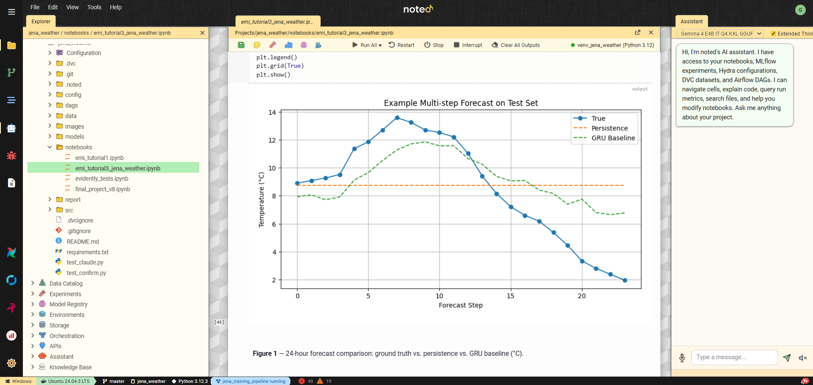
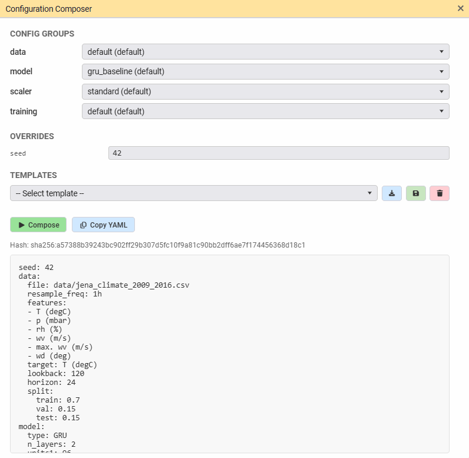
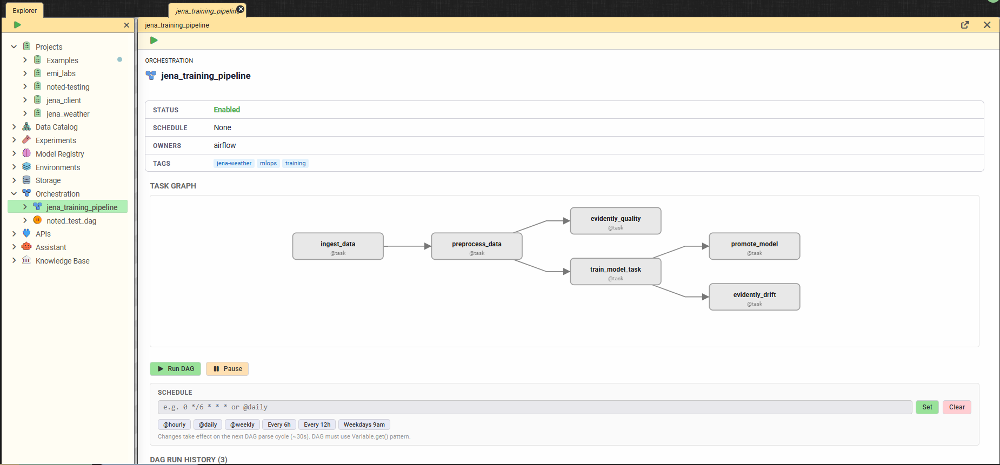
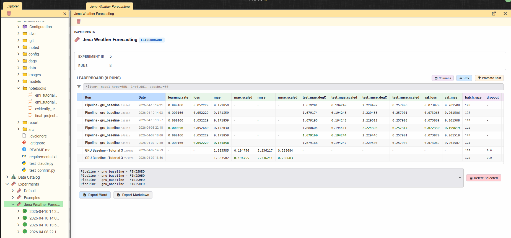
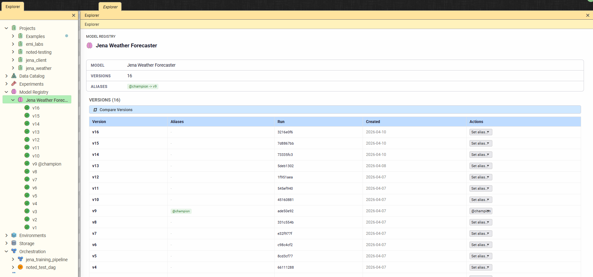
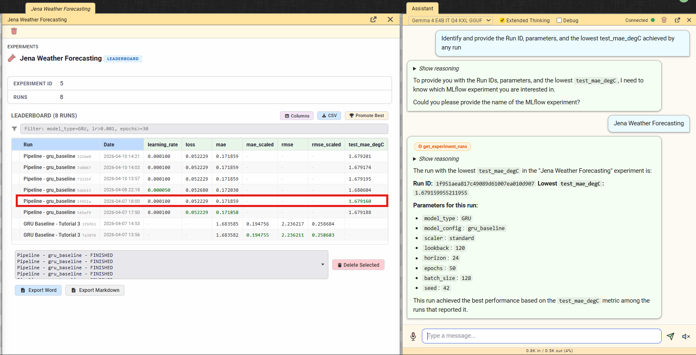

# 1. Introduction and Objectives
## 1.1 Problem Statement
This project addresses a multi-step time series forecasting problem based on the Jena Climate dataset. The objective is to predict future air temperature using historical meteorological observations, including atmospheric pressure, relative humidity, wind speed, maximum wind speed, and wind direction.

More specifically, the task is formulated as a multivariate-input, univariate-output forecasting problem, where the model receives the previous 120 hours of weather observations and predicts the temperature trajectory for the next 24 hours. This problem was selected because it provides a realistic sequential learning scenario while also supporting the implementation of a complete end-to-end MLOps workflow, including reproducible data handling, configuration management, experiment tracking, pipeline orchestration, model registration, and deployment.

## 1.2 The noted Platform
To support the development and operation of the project, an integrated environment named *noted* was used as a centralized interface for the main MLOps components. Within the scope of this work, *noted* provided access to project management, DVC-based data versioning with MinIO storage, MLflow experiment tracking and model registry, Airflow orchestration, Hydra-based configuration handling, API interaction, and notebook and file exploration. Rather than replacing these tools, the platform centralized access to them and supported a more structured execution of the end-to-end forecasting workflow. This integration also strengthened reproducibility by facilitating consistent access to versioned data, tracked experiments, and shared configurations across the pipeline.

Additionally, the *noted* platform supports multi-language execution, including Python, JavaScript, and R. It allows the use of different runtime versions for each language, enabling flexibility across ecosystems while maintaining consistent environment isolation within the platform.

## 1.3 Project Scope Alignment
This report demonstrates that the Jena Weather Forecasting project, built on the *noted* platform, fulfills all final delivery requirements:

| **Requirement**                                    | **Implementation**                                                     |
|----------------------------------------------------|------------------------------------------------------------------------|
| Automated Airflow pipeline with model registration | 6-task DAG with auto-promote to MLflow Registry                        |
| FastAPI serving layer with dynamic model loading   | noted-serving container loads @champion from registry                  |
| Functional frontend for real-time predictions      | jena_client web app (FastAPI + socket.io + Chart.js)                   |
| End-to-end demonstration pipeline                  | Hydra config -\> Airflow trigger -\> MLflow verification -\> API query |
| Docker Compose containerization                    | 12+ containers with GPU support                                        |
| Hydra configuration management                     | 4 config groups (data, model, training, scaler)                        |
| DVC data versioning                                | Jena Climate dataset tracked with MinIO remote                         |
| 100% reproducibility                               | DVC hash + Hydra hash + git commit + seed = identical results          |

**Table 1** - final delivery requirements and their implementation in noted.

# 2. Infrastructure and Containerization
## 2.1 Docker Compose Architecture
The platform runs as a multi-container deployment orchestrated via Docker Compose. The architecture separates concerns across 12+ services, each with a single responsibility:

| **Service**        | **Container**           | **Purpose**                                                  |
|--------------------|-------------------------|--------------------------------------------------------------|
| noted              | noted                   | FastAPI backend + static frontend (main platform)            |
| MLflow             | noted-mlflow            | Experiment tracking + model registry                         |
| Airflow API Server | noted-airflow-apiserver | Pipeline REST API (Airflow 3.0)                              |
| Airflow Scheduler  | noted-airflow-scheduler | DAG scheduling                                               |
| Airflow Worker     | noted-airflow-worker    | Celery task execution (GPU-enabled)                          |
| MinIO              | noted-minio             | S3-compatible object storage (DVC remote + MLflow artifacts) |
| PostgreSQL         | noted-postgres          | Shared metadata (MLflow + Airflow)                           |
| Redis              | noted-redis             | Airflow Celery broker                                        |
| Model Serving      | noted-serving           | FastAPI model inference                                      |
| Evidently          | noted-evidently         | Data quality and drift monitoring                            |
| Agent Server       | agent_server            | Local LLM inference (Gemma 4)                                |
| nginx              | noted-nginx             | Reverse proxy                                                |

**Table 2** - noted platform services and container architecture.

All services share a Docker network. The *noted* container acts as a single proxy to all backend services - secrets (API keys, database credentials) are managed server-side via Infisical and never reach the browser.

Beyond the infrastructure layer, *noted* presents a unified interface that consolidates every MLOps domain into a single application. Figure 1 shows the platform\'s VS Code-inspired layout: a persistent icon bar on the left provides one-click access to each workspace section; a collapsible Explorer sidebar exposes the full project tree alongside the complete MLOps artifact hierarchy (Data Catalog, Experiments, Model Registry, Environments, Storage, Orchestration, APIs, Assistant, Knowledge Base); a tabbed center pane hosts notebooks, file editors, pipeline views, and service tabs; and a persistent AI assistant panel occupies the right column with awareness of the active notebook, MLflow runs, DVC datasets, and Airflow DAGs. Notably, the bottom status bar shows the jena_training_pipeline executing in the background, demonstrating that pipeline orchestration and interactive notebook work proceed concurrently within the same session.

**Figure 1** - noted workspace interface with the jena_weather project open.

## 2.2 Host Directory Mounts
External projects (like the Jena Weather project) are linked into *noted* via host directory mounts configured in data/NOTED.md. On startup, *noted* auto-generates docker-compose.mounts.yml with volume entries for both the *noted* container and all Airflow services, ensuring DAGs in project dags/ folders are automatically discovered by Airflow without manual configuration.

## 2.3 GPU Support
The deployment includes NVIDIA CUDA runtime support. Training tasks in the Airflow worker container have direct GPU access, enabling accelerated model training with TensorFlow, PyTorch, and other GPU-enabled frameworks.

# 3. Reproducibility and Configuration Management
## 3.1 Reproducibility Guarantees
The platform enforces 100% reproducibility through four interlocking mechanisms:

1.  **Data versioning (DVC)**: The Jena Climate dataset (data/jena_climate_2009_2016.csv, 41.2 MB) is tracked by DVC with MinIO as the remote storage backend. Every training run is tagged with the DVC data hash (dvc_data_hash), linking the model to the exact dataset version that produced it.

2.  **Configuration hashing (Hydra)**: The resolved Hydra configuration is hashed (SHA-256) and logged as both an MLflow parameter (hydra_config_hash) and tag on every experiment run. This guarantees that two runs with the same config hash used identical hyperparameters.

3.  **Code versioning (Git)**: All source code, configuration files, and DAG definitions are tracked in Git. Experiment snapshots capture the exact git commit, creating a branch (snapshot/{experiment}\_{version}) that preserves the code state.

4.  **Seed control**: Random seeds are managed via the Hydra training config (seed parameter) and propagated to TensorFlow, NumPy, and Python's random module, ensuring deterministic training when combined with the same data and configuration.

To reproduce any experiment: clone the repository, dvc pull the data, load the Hydra config from the run's hydra_config_hash, and execute the pipeline. The result will match the original MLflow metrics exactly.

## 3.2 Hydra Configuration
Configuration is managed hierarchically using Hydra with four config groups:

> config/\
> config.yaml \# Root config with group defaults\
> data/\
> default.yaml \# Dataset paths, train/val/test splits\
> model/\
> gru_baseline.yaml \# GRU architecture (units, dropout, layers)\
> gru_evolutionary.yaml \# Evolved GRU architecture\
> training/\
> default.yaml \# Epochs, batch size, learning rate, seed\
> scaler/\
> standard.yaml \# StandardScaler\
> robust.yaml \# RobustScaler\
> minmax.yaml \# MinMaxScaler

The *noted* interface exposes Hydra\'s configuration system through a dedicated Configuration Composer panel, shown in Figure 2. Rather than editing YAML files directly, users select options from each config group via dropdowns, dataset parameters, model architecture, scaler type, and training hyperparameters are composed on demand. Clicking \"Compose\" resolves the full configuration and displays the resulting YAML alongside a SHA-256 hash of the composed output. This hash is automatically logged as both an MLflow parameter and a run tag on every experiment, creating a direct and auditable link between a model\'s performance and the exact configuration that produced it. The seed override field and templates system allow practitioners to save and reload frequently used configurations, ensuring consistent hyperparameter management across notebook experiments and Airflow pipeline runs alike.

.

**Figure 2** - Hydra Configuration Composer panel.

# Pipeline Orchestration (Apache Airflow)

## 4.1 DAG Architecture
The Jena Weather training pipeline is implemented as an Airflow 3.0 DAG (dags/jena_training_pipeline.py) with six tasks:

> ingest_data (1.5s)\
> \|\
> preprocess_data (0.4s)\
> \|\
> +\-- evidently_quality (4.8s) \[parallel branch\]\
> \|\
> +\-- train_model_task (192.5s) \[parallel branch\]\
> \|\
> +\-- promote_model (1.0s)\
> \|\
> +\-- evidently_drift (7.8s)

**Task descriptions:**

1.  **ingest_data**: Loads the raw CSV from DVC-tracked path, validates schema, writes to /tmp parquet for downstream tasks

2.  **preprocess_data**: Applies feature engineering (cyclical time features, rolling statistics), scales features using the Hydra-configured scaler, creates sliding windows

3.  **evidently_quality**: Runs Evidently data quality report on the preprocessed data (parallel with training)

4.  **train_model_task**: Builds and trains the GRU model per Hydra config, logs metrics and artifacts to MLflow (192.5s on GPU)

5.  **promote_model**: Compares the new model against the current \@champion in the MLflow Registry; promotes if test MAE improves

6.  **evidently_drift**: Runs Evidently drift detection by comparing train and test distributions. Figure 3 illustrates the orchestration view used to monitor the jena_training_pipeline DAG within *noted*. This purpose-built interface renders the full task graph, surfaces pipeline metadata, exposes execution controls, and maintains a run history, all without opening a separate Airflow browser tab. The parallel branch architecture is clearly visible: after data ingestion and preprocessing, evidently_quality and train_model_task execute concurrently, with promote_model and evidently_drift completing the pipeline. The sidebar tree shows three previous successful executions with their timestamps, confirming the pipeline has been validated across multiple runs. The visual schedule builder at the bottom supports cron-based scheduling through human-readable presets, making recurring pipeline execution accessible without requiring Airflow UI access or cron syntax knowledge.

**Figure 3** - noted native Orchestration view for the jena_training_pipeline DAG.

## 4.2 Configuration Integration
The DAG is parameterized via Airflow DAG params that map directly to Hydra config groups. When triggered from the *noted* UI, the Configuration Composer panel's selections are passed as DAG parameters. The DAG tasks read the same Hydra YAML configs that notebooks use, ensuring configuration consistency across interactive and automated execution.

## 4.3 Modular Source Code
All pipeline logic resides in reusable src/ modules shared between the notebook and the Airflow DAG:

| **Module**                | **Purpose**                              |
|---------------------------|------------------------------------------|
| src/data/ingestion.py     | Data loading and validation              |
| src/data/preprocessing.py | Feature engineering and preprocessing    |
| src/data/preparation.py   | Scaling, windowing, train/val/test split |
| src/training/pipeline.py  | Model building, training, MLflow logging |
| src/evaluation/metrics.py | Test evaluation metrics (MAE, RMSE, R2)  |
| src/evaluation/promote.py | Champion comparison and auto-promotion   |

This design eliminates code duplication: the notebook calls the same functions that Airflow tasks execute. Changes to data processing logic automatically propagate to both execution paths.

# 5. Experiment Tracking and Model Registry
## 5.1 MLflow Integration
The *noted* platform provides zero-config MLflow connectivity. The MLFLOW_TRACKING_URI is injected into every kernel automatically - import mlflow just works without any boilerplate. The platform supports two complementary tracking modes:

1.  **Auto-instrumentation**: The Run Manager UI defines named cell groups as reusable run templates. Executing a run wraps the selected cells in mlflow.start_run()/end_run() automatically, with framework autologging activated for TensorFlow, scikit-learn, and other supported frameworks.

2.  **Pipeline tracking**: Airflow DAG tasks call MLflow directly through the src/training/pipeline.py module, logging metrics (test_mae, test_rmse, test_r2), parameters (all Hydra config values), and artifacts (trained model, training history).

Both modes automatically tag runs with the DVC data hash and Hydra config hash, providing full lineage traceability.

## 5.2 Experiment Results
Figure 4 presents the experiment leaderboard for the Jena Weather Forecasting experiment within the *noted platform*. Rather than navigating to the MLflow UI, practitioners access a purpose-built comparison view directly within the *noted* workspace. The leaderboard displays all 8 completed runs with their full metric sets, training loss, MAE, RMSE, scaled variants, and validation metrics, with best values highlighted per column for immediate visual identification of the strongest run. An active filter (model_type=GRU, lr\>0.001, epochs\>=30) narrows the view to relevant configurations. The run list distinguishes between Airflow pipeline runs and notebook-originated runs by name, and the sidebar tree lists each execution individually with timestamps and completion status. The \"Promote Best\" action saves the best run\'s parameters as a reusable Hydra template, directly closing the loop between experiment results and future pipeline configuration.

**Figure 4** - noted native experiment leaderboard for the Jena Weather Forecasting experiment

## 5.3 Automated Model Registration and Promotion
The promote_model task in the Airflow DAG implements automatic champion selection:

1.  After training completes, the new model's test MAE is compared against the current \@champion model in the MLflow Registry

2.  If the new model improves on the champion's metric, it is registered as a new version and the \@champion alias is reassigned

3.  The promotion decision is logged as an MLflow tag for audit

This ensures the serving endpoint always loads the best available model without manual intervention.

Figure 5 presents the Model Registry view for the Jena Weather Forecaster within the *noted* platform. The registry displays all 16 registered model versions, each linked to the MLflow run that produced it through a traceable run ID. Version 9 carries the \@champion alias, identifying it as the current production model loaded by the serving container. The alias is managed directly from the *noted* interface through the \"Set alias\" action on any version row, with the sidebar tree reflecting the current champion assignment. The breadth of the version history, 16 versions registered across three days of pipeline executions, demonstrates the automated registration and promotion pipeline described in Section 5.3 operating continuously: each successful Airflow pipeline run produces a new candidate version, which is promoted to \@champion only if it improves on the current champion\'s test MAE.

**Figure 5** - noted native Model Registry view for the Jena Weather Forecaster model

# 6. Model Serving and Frontend
## 6.1 FastAPI Serving Layer
The *noted-serving* container is a dedicated FastAPI service that dynamically loads any registered model from the MLflow Registry on demand. Key capabilities:

-   **Dynamic model loading**: Load any model version by name and version/alias. The \@champion alias provides a stable reference to the best model

-   **Schema-aware input validation**: Pydantic schemas derived from the model's MLflow signature validate incoming JSON requests

-   **Multi-framework support**: Pre-installed TensorFlow, PyTorch, scikit-learn, XGBoost, and LightGBM for model inference

-   **Health monitoring**: a /health endpoint is provided, with serving status displayed in the *noted* status bar

## 6.2 noted "Try It" Panel
Within the *noted* platform, the Model Registry section provides a "Try It" panel for any registered model. The panel generates a dynamic input form based on the model's schema signature, forwards the request through the *noted* backend, which proxies it to the serving container, and renders the response as charts (ECharts), tables, or formatted JSON.

## 6.3 Jena Client Web Application
In addition to the built-in serving interface provided by the *noted* platform, a standalone web application (jena_client) was developed to demonstrate model serving for end users:

-   **Backend**: FastAPI + socket.io server that connects to the noted-serving container

-   **Frontend**: Vanilla HTML/CSS/JavaScript with Chart.js for interactive forecast visualization

-   **Features**: Real-time temperature predictions, historical data overlay, dark/light theme toggle

-   **Deployment**: Runs as a separate service, accessible to users who don't need the full noted platform

This dual approach demonstrates both integrated (Try It panel) and standalone (jena_client) serving patterns.

# 7. AI-Powered Development Assistant
## 7.1 Dual-Backend Architecture
The *noted* platform integrates an AI assistant capable of understanding the full MLOps workspace and interacting with it through structured tool calls. The assistant supports two inference backends:

-   **Gemma 4 E4B** (local, via llama-cpp-python): On-premises inference with 128K context window. No data leaves the host. Native tool calling via trained \<\|tool_call\> special tokens

-   **Anthropic Claude** (Sonnet 4.6, Opus 4.6, Haiku 4.5): Cloud API with 200K context window. Native tool calling via Anthropic's tools array and tool_use content blocks

Both backends use their model-native tool calling mechanisms rather than text-based prompt injection, ensuring reliable structured arguments and eliminating parsing fragility.

## 7.2 MCP Server (Model Context Protocol)
The *noted* platform exposes its capabilities through an MCP server at /mcp/, allowing external AI clients such as Claude Code, Claude Desktop, and Cursor to interact with the platform programmatically, without relying on the *noted* interface. The server uses Streamable HTTP transport with the official mcp Python SDK, includes rate limiting (tiered token bucket: read 30/min, write 10/min), and a structured error taxonomy. This transforms *noted* from a notebook with an AI chat into a headless AI execution engine controllable by any MCP-compatible client.

## 7.3 Tool System
The platform includes a set of 25 tools that provide read and write access to the MLOps stack, covering MLflow experiments and runs, Airflow DAG status and task logs, DVC-tracked files, Hydra configurations, project files, Knowledge Graph entities, notebook cell navigation, web content fetching through the Camoufox browser, and lint diagnostics. Write operations, such as update_cell, insert_cell, and create_file, require explicit user confirmation with a diff preview.

A Dynamic Context Router selects only the relevant tool schemas per turn for Claude (typically 5-8 out of 25), reducing token cost while maintaining full tool coverage.

Figure 6 demonstrates the AI assistant\'s tool system in action. In response to a natural language query requesting the best-performing run and its parameters, the assistant engaged in a clarification dialogue before invoking the get_experiment_runs tool, visible as an orange badge in the response, to query the MLflow tracking backend directly.

The assistant identified run 1f951aea as the best-performing execution, achieving the lowest test_mae_degC value of 1.6792°C, and returned its full parameter configuration, including model type, architecture setting, scaler, lookback window, forecast horizon, number of training epochs, batch size, and random seed. The leaderboard displayed simultaneously in the left pane confirms this result, with the selected run clearly highlighted. This interaction illustrates how the assistant connects natural language queries with structured MLOps metadata, enabling users to inspect experiment results, compare configurations, and retrieve lineage information conversationally, without manually navigating the interface.

**Figure 6** - AI assistant using the get_experiment_runs tool to identify the best-performing run

## 7.4 Web Content Fetch
The fetch_url tool retrieves web content using Camoufox, a persistent anti-detect Firefox browser with C++ level TLS fingerprint spoofing. The browser launches once as a singleton and stays warm for subsequent requests. This enables the assistant to read documentation, API references, or any URL shared by the user and incorporate the content into its analysis.

# 8. Demonstration Pipeline: End-to-End Workflow
The following walkthrough demonstrates the complete lifecycle within the *noted* platform, from configuration to prediction:

## Step 1: Configuration
Open the Jena Weather project in *noted*. The Configuration Composer panel shows four Hydra config groups. Select model: gru_baseline, scaler: standard, training: default (30 epochs, batch 256, LR 0.0005, seed 42).

## Step 2: Pipeline Trigger
Click "Run as Pipeline" from the notebook bar, or navigate to the Orchestration section and trigger the jena_training_pipeline DAG. The composed Hydra configuration is passed as DAG parameters. The 6-task pipeline begins execution.

## Step 3: Live Monitoring
The execution status of the pipeline is displayed in the *noted* status bar through a blue status indicator. Real-time task updates are provided in the Orchestration tree via Socket.IO polling, and training progress is monitored in the Live Metrics panel through epoch-by-epoch loss curves.

## Step 4: Verification
After completion (total \~3m25s), navigate to the Experiments section. The new run appears with logged metrics (test MAE: \~2.02 C, test RMSE: \~2.56, test R2: \~0.893). The run is tagged with the DVC data hash and Hydra config hash.

## Step 5: Auto-Promotion
The promote_model task compared the new model against the existing champion. If the test MAE improved, the model was registered in the MLflow Registry with the \@champion alias. The Models section in the Explorer shows the registered model with its version, signature, and lineage chain.

## Step 6: Prediction
The jena_client web application or the Try It panel available in the *noted* platform can then be used to submit a forecast request based on recent climate features. The FastAPI serving container loads the \@champion model from the registry and returns the corresponding temperature predictions. These predictions are then rendered in the frontend alongside the historical observations using Chart.js.

## Step 7: Evidently Reports
The Evidently UI (accessible from the *noted* sidebar) shows two reports generated during the pipeline: a data quality report (from the evidently_quality task) and a drift detection report (from the evidently_drift task, comparing train vs test distributions). 6 of 16 features showed statistically significant drift (37.5%).

# 9. Conclusion
## 9.1 Concluding Remarks
This project demonstrated the design and implementation of a complete end-to-end MLOps workflow for multi-step air temperature forecasting using the Jena Climate dataset. Beyond the forecasting task itself, the main contribution of the work lies in the engineering of a reproducible, modular, and automated machine learning pipeline covering data versioning, configuration management, orchestration, experiment tracking, model registration, and serving.

The final system integrates all major components required by the project specification. The workflow includes DVC-based dataset versioning with MinIO remote storage, Hydra-driven configuration management, Apache Airflow orchestration, MLflow experiment tracking and model registry, a FastAPI serving layer, and a functional frontend for real-time interaction. Together, these components establish a consistent lifecycle from raw data ingestion to deployed inference.

An additional contribution of the project was the use of the *noted* platform as an integrated operational environment. Within the scope of this work, the platform supported interaction with the different MLOps services through a centralized interface, helping organize experimentation, monitoring, orchestration, and model access more efficiently. However, the core value of the project remains the forecasting pipeline itself and its alignment with reproducibility and deployment-oriented engineering practices.

The project satisfies the final delivery requirements while also extending them with complementary capabilities such as integrated monitoring through Evidently, automated model promotion in the MLflow registry, and assistant-supported interaction with the workspace. These additions strengthen the practical value of the system and reinforce its orientation toward real-world MLOps scenarios.

## 10. Future Enhancements
Several extensions can further strengthen the platform and the overall MLOps workflow developed in this project. A first relevant direction is the expansion of MCP-based external access, allowing external AI clients to interact with the system through scoped API keys and controlled read/write permissions. This would make the platform more flexible while preserving security and governance.

Another promising enhancement is the introduction of an MCP resource layer, enabling passive access to environment state through structured URIs, such as MLflow metrics, DVC lineage information, and Airflow pipeline status. This would improve interoperability with external tools and AI-driven agents.

From a performance perspective, the system could also benefit from KV cache persistence for local LLM inference, allowing conversation state reuse and reducing latency in repeated assistant interactions. In addition, Evidently quality gates could be introduced before pipeline execution so that training is automatically interrupted whenever data quality thresholds are not met.

Further improvements may include impact analysis supported by the knowledge graph, enabling queries such as identifying which components would be affected by a given change, as well as inline code completion features supported by LLM integration to improve development productivity within the platform. These enhancements would extend the system beyond its current capabilities and reinforce its value as a more complete and intelligent MLOps environment.
